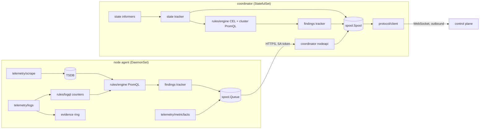

# Architecture and internal contracts

This document fixes the Go contracts between packages so they can be built and tested independently. Protocol semantics are normative in `protocol/SPEC.md`; product requirements are in the PRD.

## Process model



A host agent runs every box of both roles in one process with no Kubernetes components and no nodeapi hop.

## internal/kv

`kv.Store` (Get, Put, Delete, ForEach, Batch) is the durable metadata interface used by every component that persists small state: alert state, log offsets, journal cursors, bundle state, key manifest sequence, idempotency cursors. `kv.NewBolt` backs it with bbolt; `kv.NewMemory` is for tests.

## internal/spool

```go
type Options struct {
	Dir           string        // coordinator PVC mount or /var/lib/exitmesh/spool
	CapacityBytes int64         // hard budget for record bodies
	WindowBytes   int64         // transmitted-unconfirmed window, default 8 MiB
	SegmentBytes  int64         // default 64 MiB
	CoalesceAt    float64       // default 0.90 of capacity
	Clock         func() time.Time
	CommitFault   func() error  // tests only: fails a transaction's metadata commit after its bodies were written
}

func Open(opts Options) (*Spool, error) // takes flock on Dir/LOCK (ErrLocked if held), creates the writer ID on first open, increments and fsyncs the incarnation
func (s *Spool) Close() error
func (s *Spool) WriterID() protocol.WriterID
func (s *Spool) Incarnation() uint64
func (s *Spool) Identity() Identity            // TargetID, TargetType, Credential, CredentialID, MachineID
func (s *Spool) SetIdentity(Identity) error
func (s *Spool) Epoch() (EpochState, bool)     // ID, OpenReason, PrevEpoch, PrevHead, Registered, Chain position
func (s *Spool) OpenEpoch(reason string, prev *protocol.EpochID, prevHead *uint64) (protocol.EpochID, error)
func (s *Spool) MarkRegistered() error
func (s *Spool) Do(fn func(tx *Tx) error) error // holds the sequence lock; every append happens inside Do
func (tx *Tx) Append(t protocol.RecordType, build func(env protocol.Envelope) (*protocol.Record, error), opts ...AppendOption) (*Entry, error)
func (tx *Tx) OnCommit(f func())                    // runs after the durable commit, still under the sequence lock; never when Do fails
func (tx *Tx) DeleteCursor(key string)              // removed atomically with the transaction
func WithCursor(key string, value uint64) AppendOption // persisted atomically with the record (node submission idempotency)
func (s *Spool) Cursor(key string) uint64
func (s *Spool) Cursors(prefix string) map[string]uint64
func (s *Spool) Entries(fromSeq uint64) []*Entry    // spooled records above the committed head in chain order
func (s *Spool) MarkTransmitted(seqs ...uint64) error // durable before the first byte is sent
func (s *Spool) Commit(epoch protocol.EpochID, seq uint64, chainHash protocol.Hash) error
func (s *Spool) LastCommitted() (protocol.ChainPoint, bool)
func (s *Spool) DiscardAbove(seq uint64) error
func (s *Spool) Relieve() (Relief, error)          // PRD S13 order: evict evidence, compact samples, coalesce
func (s *Spool) Usage() Usage                      // bytes, capacity, records, oldest, projected window
func (s *Spool) Notify() <-chan struct{}           // signalled after appends and commits
func (s *Spool) SaveRecoverySnapshot(b []byte) error
func (s *Spool) LoadRecoverySnapshot() ([]byte, bool, error)
func (s *Spool) KV(bucket string) kv.Store

type Entry struct {
	Seq       uint64
	Type      protocol.RecordType
	State     RecordState // NeverTransmitted, TransmittedUnconfirmed
	Bytes     []byte      // exact record bytes
	Hash      protocol.Hash
	ChainHash protocol.Hash
}

func OpenQueue(dir string, capacityBytes int64) (*Queue, error) // node agent queue under /var/lib/exitmesh/queue
func (q *Queue) ID() string                                     // random identity created with the queue (QUEUE_ID); a lost state directory yields a new one
func (q *Queue) Append(b []byte) (uint64, error)               // fsync before return
func (q *Queue) Peek(fromSeq uint64, maxBytes int) []QueueItem
func (q *Queue) Ack(seq uint64) error
func LockDir(dir string) (unlock func() error, err error)      // exclusive flock, ErrLocked if held
```

## pkg/protocol/client

The writer session client is transport-agnostic and implemented against interfaces satisfied by `internal/spool` and `internal/tunnel`.

```go
type Store interface { /* the subset of *spool.Spool used above */ }
type Transport interface { Dial(ctx context.Context) (Conn, error) }
type Conn interface {
	Call(ctx context.Context, method string, params, result any) error
	Notify(ctx context.Context, method string, params any) error
	SendBinary(ctx context.Context, frame []byte) error
	Handle(h Handler)               // incoming requests and notifications
	Done() <-chan struct{}
	Close() error
}
type Hooks interface {
	CaptureReplay(tx CaptureTx) (protocol.SummaryParams, error) // S17 step 3, runs inside Store.Do
	Rebaseline(tx CaptureTx) error                              // emit the full checkpoint of a new epoch
	BundleAvailable(protocol.BundleAvailableParams)
	Tool(ctx context.Context, name string, args json.RawMessage) (any, error)
	Health() any
}
```

## internal/telemetry

- `scrape.Manager` scrapes a target list (kubelet `/metrics`, `/metrics/cadvisor`, annotated pods, loopback endpoints on hosts) into a `storage.Appendable` with per-node budgets (targets, series, samples per second) and reports dropped targets.
- `tsdb.Open(dir, Retention, MaxBytes)` wraps `github.com/prometheus/prometheus/tsdb` and exposes `storage.Queryable` and `storage.Appendable`.
- `logs.Tailer` tails `/var/log/pods/<ns>_<pod>_<uid>/<container>/*.log` (CRI and docker json formats), persists offsets in a `kv.Store`, handles rotation, CRI partial lines, and oversized lines, and delivers `logs.Line{Labels map[string]string, Time time.Time, Text string}` only for streams accepted by a filter. `logs.ReadRange` performs bounded on-demand reads for investigation.
- `evidence.Ring` holds redacted matched lines under a per-node byte ceiling with per-rule shares and reports evidence-limited rules.
- `metricfacts.Compute(ctx, queryable, now, interval)` returns per-resource metric facts (PRD 7.2).
- `DiskBudget` enforces the node agent cap across queue, TSDB, and offsets.

## internal/rules

- `bundle` parses `bundle.tar.gz`, validates rules, verifies signatures against the trust store (`bundle.Verifier`), and processes key manifests (PRD R2, R2a).
- `logql` is the in-house LogQL subset: parser, printer, validation, streaming counters for rules, bounded query evaluation for investigation, scope injection, and LogQL to LogsQL translation.
  ```go
  func CompileRule(expr string, b bundle.Budget) (*Program, error) // subset and counter-budget validation
  func (p *Program) Matches(streamLabels map[string]string) bool   // stream filter for the tailer (PRD L3)
  func (p *Program) Observe(streamLabels map[string]string, ts time.Time, line string) (matched bool)
  func (p *Program) Eval(ts time.Time) (promql.Vector, error)
  func (p *Program) Window() time.Duration
  func (p *Program) MemoryBytes() int
  func InjectScope(query string, m []*labels.Matcher) (string, error) // AST-level, re-serialized
  func ToLogsQL(query string) (string, error)                          // exact mapping or error with reason
  func RunQuery(ctx context.Context, query string, src LineSource, lim Limits) (*Result, error)
  ```
- `engine` evaluates state rules (CEL), PromQL rules, and LogQL rules with `for` and `keep_firing_for`, per-rule budgets, per-rule states (PRD R9), cross-node decomposition (PRD M4), and alert state persistence in `kv.Store`. It emits `engine.AlertEvent` values to a sink.
- `engine.MemSeries` is an in-memory `storage.Queryable` for synthesized `kube_*` and pushed pre-aggregated series.

## internal/findings

`findings.Tracker` turns alert events into finding records: deterministic dedup key and finding ID, episodes (firing, update, resolved, stale, fresh), counts, first and last seen, capped evidence, and the lifecycle summary at a watermark. Episodes persist in a `kv.Store`.

## internal/state

`state.Tracker` holds the normalized state of a cluster. Informer events call `Upsert(obj)` and `Remove(obj)`, which return canonical `[]protocol.Op` for the resource and its outgoing edges. `Reconcile(kind, namespace, objects)` implements relist and diff with the synthetic flag. `ScopeLost` and `ScopeRestored` produce scope-set ops. `KubeSeries` synthesizes the published `kube_*` subset from state. The field catalog is in `internal/state/catalog.go` and rendered into `docs/field-catalog.md`.

## Node to coordinator API

HTTPS on the coordinator ClusterIP Service, port 8443, TLS from the chart, bearer projected ServiceAccount token (audience `exitmesh-coordinator`, 600 s) validated offline against the issuer JWKS.

|Method and path|Purpose|
|---|---|
|`POST /v1/node/register`|Node name, agent version, bundle version, capabilities, coverage, rule states.|
|`POST /v1/node/records`|CBOR batch of node queue items (findings, metric facts, pre-aggregated series) with node sequences and the queue identity; acknowledged after fsync to the coordinator spool.|
|`GET /v1/node/bundle?have=`|Long-poll for the target bundle.|
|`GET /v1/node/kube?since=`|Long-poll for `kube_node_*` and non-pod `kube_*` series for this node.|
|`GET /v1/node/tasks`|Long-poll for investigation and aggregation tasks.|
|`POST /v1/node/tasks/{id}`|Task result.|

Task kinds: `promql_query`, `logql_query`, `log_read`, `evidence_read`. Bundle payloads forward the control plane's key manifest chain unchanged so node agents verify bundles against the deployment's trust roots themselves.

Every submission for a node other than the token's authenticated node is rejected and audited.

The coordinator publishes a transaction's changes to its in-memory chain head (collector deltas, metric facts, checkpoint statistics, node finding index) only from `Tx.OnCommit`, after the spool committed the records durably. A failed write or fsync leaves the head as it was, so the resynchronization that follows emits the net difference, including the change that failed.

Submissions carry the node queue identity (`SubmitRequest.Queue`, CBOR key 3). The coordinator keeps one idempotency cursor per node and queue (`node/<node>/<queue>`); items at or below it are acknowledged without being spooled again. A queue identity the coordinator has not seen is a new sequence space: a reimaged node restarts at sequence 1 and its records are spooled, and the node's other cursors (including the per-node cursor of agents that predate queue identities) are deleted in the same transaction. Cursors of nodes that stayed uncovered past the node timeout and left the cluster state are pruned. Upgrading a node agent creates a queue identity for its existing queue, so at most the items whose acknowledgement was lost before the upgrade are spooled a second time.

Node agents retry every submission failure with backoff, rereading the token file on each attempt, and keep the queue intact: authentication (401), authorization (403), and transport failures never drop items. Only a request refused as malformed (400, or 413 for an oversized batch) is resent item by item, and only an item refused on its own is dropped and counted as rejected.

Pod metric facts carry the pod UID the node observed in its pod watch when it computed them (`Fact.UID`). The coordinator applies a fact only to the pod with that UID on the submitting node and drops facts whose pod no longer exists, counting them in `facts_dropped` of the node's health entry, so facts delayed across a pod recreation never reach the replacement. Facts from agents without UIDs resolve by namespace and name and apply only while exactly one live pod of the node has that name; during a rolling upgrade such a fact queued for a pod that was recreated can still reach its replacement, which is the previous behavior.

Registrations carry the node's rule states (`RegisterRequest.Rules`, CBOR key 8, at most 1024, reasons redacted and at most 512 bytes): rule ID, version, state, reason, last evaluation, and budget-limited and evidence-limited flags. The coordinator keeps the latest per node; coordinator health lists, per node, the rules that are not plainly active (at most 64, most severe first) with counts per state, and `node_rules` rolls the states of covered nodes up per rule version (at most 2048 entries).

Node agents apply the administrator's namespace scope (`kubernetes.scope: namespaces` with `kubernetes.namespaces`, and `kubernetes.excludeNamespaces`) before any stream is read: the pod watch tracks only in-scope pods (one `spec.nodeName` watch per namespace in the namespaces profile), the tailer filter rejects out-of-scope streams, and `logql_query` and `log_read` tasks get the scope ANDed into every stream selector before the executor opens a file, so aggregates never count out-of-scope lines. `evidence_read` results are filtered by namespace as well.

New CBOR keys are optional and unknown keys are ignored, so node agents and the coordinator can differ by one release in either direction.

## internal/admin

Local administration API on `<stateDir>/admin.sock` (mode 0600, HTTP over a unix socket, never a network listener): `GET /v1/status`, `POST /v1/investigate`, `GET /v1/export?from=`, `POST /v1/deenroll`, `POST /v1/commit` (air-gap commit receipt). Roles implement `admin.Backend`; the CLI uses `admin.Dial(stateDir)`. This is how `export`, `investigate`, and `deenroll` work while the running agent holds the state lock.

## internal/investigate

```go
func NewService(o Options) (*Service, error)
type Options struct {
	Role        string                     // coordinator or host
	State       func() *protocol.State     // current normalized state and change graph
	Local       *Executor                  // host: local TSDB, logs, journal; coordinator: nil
	Nodes       NodeRouter                 // coordinator: fan-out to node agents; host: nil
	Coordinator storage.Queryable          // coordinator-side series (kube_* and pushed parts)
	Lookback    []config.Lookback
	HTTPClient  *http.Client
	Limits      config.Investigation
	Audit       func(AuditRecord)          // PRD I5, sent as investigation.audit
	SaveFinding func(findings.Observation) error // PRD I8
	Clock       func() time.Time
}
func (s *Service) Tools() []client.Tool
func (s *Service) Call(ctx context.Context, name string, args json.RawMessage) (any, error)

type NodeRouter interface {
	Nodes() []string
	Run(ctx context.Context, node string, t nodeapi.Task) (nodeapi.TaskResult, error)
}

func NewExecutor(o ExecOptions) *Executor // node agents and hosts: PromQL over the local TSDB, LogQL over on-demand reads, evidence
func (e *Executor) Execute(ctx context.Context, t nodeapi.Task) nodeapi.TaskResult
```

Tools: `state.query`, `graph.query`, `promql.query`, `logql.query`, `logsql.query`, `lookback.query`, `evidence.query` (non-destructive reads of node evidence rings through node task kind `evidence_read`), `finding.save`. Every query is parsed with its language's parser, scope matchers are injected at the AST, and it is re-serialized (PRD I2). Results carry source, window, limits, truncation, limitations, and the query hash; nothing is retained.

## Roles

```go
func coordinator.Run(ctx context.Context, cfg *config.Config, log *slog.Logger) error
func node.Run(ctx context.Context, cfg *config.Config, log *slog.Logger) error
func host.Run(ctx context.Context, cfg *config.Config, log *slog.Logger) error
```

Recovery snapshot invariant (coordinator and host): the writer persists the normalized state at a known sequence with `Spool.SaveRecoverySnapshot`, and before the spool drops committed records up to `s` the snapshot sequence must be at least `s`. Commits from the session client are therefore applied through a wrapper that refreshes the snapshot first (throttled). On restart the writer loads the snapshot, replays spooled records above it to recover the exact state at the chain head, then relists and emits synthetic deltas for anything that changed while it was down (PRD S14), so neither a graceful restart nor a crash changes the epoch.

Air-gap profile: the coordinator (or host) appends records as usual; delivery goes to rolling export files in `airgap.exportDir` instead of the tunnel, records are marked transmitted when written, and a commit receipt imported from ExitMesh (`exitmesh-agent commit --receipt`) applies `Commit`. Bundles and key manifests are read from `airgap.bundleDir` with identical verification.

## Trust roots

Rule bundle trust roots belong to the ExitMesh deployment (every self-hosted deployment has its own) and are configured per agent in `trust.roots` or `trust.rootsFile`; nothing is pinned into releases. `bundle.LoadRoots` builds the root set and `bundle.NewVerifier` persists the verified key manifest sequence and adopted successor roots in `kv`. Every role verifies bundles itself: the coordinator and host on fetch, node agents on distribution.

## Telemetry absence

PromQL rules whose scraped inputs have no series are `stale`, and their firing instances become `stale` rather than `resolved` (PRD G8, 7.7). Steadily firing LogQL instances are re-observed each cycle when new evidence arrives, so counts and samples keep updating (PRD 5.3), subject to the findings tracker's update interval.
